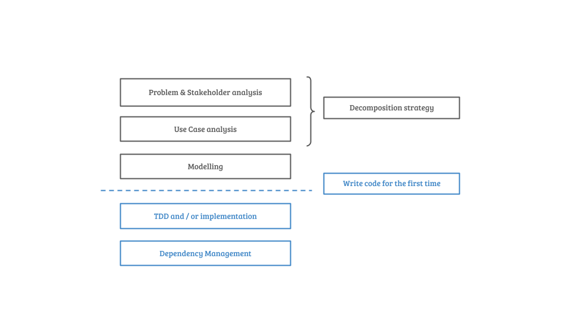

# Tips to get started

Having difficulties to get started? Don't worry, it is normal. Here are some tips to put you on your way

## Overcome analysis paralysis

It is great that you start thinking about the problem, but at some point you need to start doing something. In the face
of an overwhelming large project (this one might overwhelm you), your first strategy should be **to divide and conquer**.  

In other words, you should break down the big problem into smaller problems. This is exactly what we are learning in the
'About Coding Dojo': 

So step 1 would be to identify all the different use cases. This project is formulated with very clearly separated 
aspects. I have done this on purpose, otherwise you would spend too much time figuring out what to do. So for this challenge, 
go over each aspect and write down the use cases you have identified.  

After you have done that, pick one use case. Start analysing that use case. Start to formulate a plan for a solution for
this use case. Rince and repeat for all use cases. Guess what... you have just actually started with this big project.  

## Keep it simple

The key to effective designing solutions is keep it simple. Don't worry too much about what might or might not happen in
the future. You can't possibly guess that. Instead, **aim for the most minimal and most simple solution** for the problem you 
are solving. Fix the problem you are having now. This is a key element in real senior developer: They think about the most
simple way of solving something. If that solution is causing more problems than it fixes, they go for the next solution.  

Remember, you solution does not need to be perfect. It needs to be maintainable. 